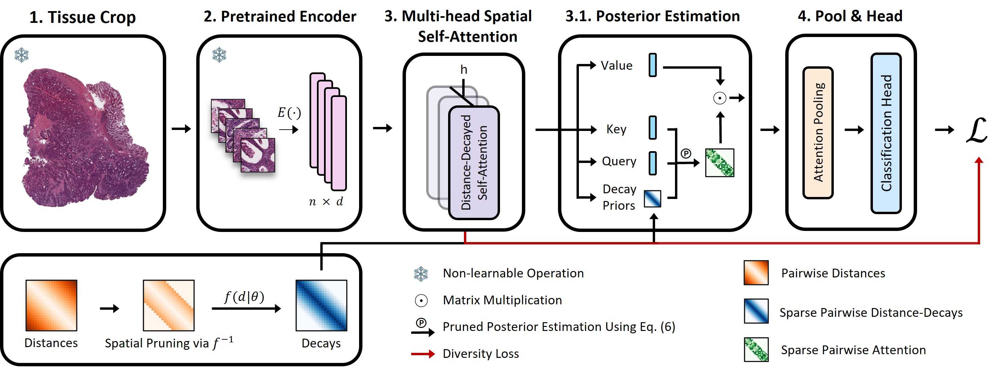

# PSA-MIL: Probabilistic Spatial Attention-Based Multiple Instance Learning for Whole Slide Image Classification

> **Accepted at WACV 2026**

<div align="center">

  <a href="https://arxiv.org/abs/2503.16284">
    
  </a>
  
  
  

</div>

## PSA-MIL Overview


## Updates
- **2026-09-28** – Complete code refactor. Slide features now come from [TRIDENT](https://github.com/mahmoodlab/TRIDENT) HDF5 files, tasks are plain split folders (`config.yaml` + `k=all.tsv`), and spatial attention is vectorized. Train with `python train.py --config <yaml>`.
- **2025-11-14** – Added ready-to-use configuration files for datasets including CAMELYON16 and TCGA.
- **2025-11-07** – Accepted at **WACV 2026**.
- **2025-05-20** – Refactored core modules for improved code structure and utility.
- **2025-05-15** – Added support for the survival prediction task.
- **2025-04-17** – Introduced a diversity loss option using Gaussian binning, which showed greater stability compared to the Monte Carlo-based approach.
- **2025-03-26** – Initial project launch.

## Highlights
- **State-of-the-Art Performance** – Achieves leading results on a variety of WSI-related benchmarks.
- **Probabilistic Spatial Attention** – Learns spatial dependencies through adaptive, data-driven priors.
- **Dynamic Local Attention** – Derives spatial scope (K) during training, avoiding fixed spatial assumptions.
- **Computational Efficiency** – Reduces self-attention quadratic complexity using a spatial pruning strategy.
- **Diversity Loss** – Promotes distinct spatial patterns across attention heads to enhance feature representation.

<details>
  <summary><b>What is PSA-MIL?</b></summary>

PSA-MIL is an attention-based Multiple Instance Learning (MIL) framework for Whole Slide Image (WSI) classification.
It introduces a probabilistic formulation of self-attention to incorporate spatial relationships among image tiles.

### Key Contributions
- **Probabilistic Spatial Attention.** Self-attention is a posterior with learnable distance-decayed priors, so the locality of each head is inferred during training.
- **Spatial Pruning.** Connections whose prior falls below a threshold are dropped, which avoids full quadratic attention.
- **Diversity Loss.** An entropy penalty pushes heads toward different spatial ranges.

</details>

# Installation

```bash
conda env create -f env.yml
conda activate pytorch_env
```

Or with pip:

```bash
python -m venv psa-mil-env
source psa-mil-env/bin/activate
pip install -r requirements.txt
```

# Data

Features are TRIDENT outputs. A typical directory looks like:

```
20x_512px_0px_overlap/
  features_conch_v15/
    {slide_id}.h5      # datasets: features (N, D), coords (N, 2)
```

`coords` are level-0 pixel positions. PSA-MIL converts them to tile steps by dividing by the `patch_size_level0` attribute, which is the unit the decay radius is defined in.

A task is a folder with:

- `config.yaml` — `task_col`, `label_dict`, `sample_col` (usually `case_id`)
- `k=all.tsv` — one row per slide: `case_id`, `slide_id`, the label, and `fold_*` columns with `train` or `test`

That is the same layout as a [Patho-Bench](https://github.com/mahmoodlab/Patho-Bench) task. Point `data.task_dir` at the folder and `data.trident_dir` at the matching TRIDENT directory. See [`configs/examples/cptac_coad_kras.yaml`](configs/examples/cptac_coad_kras.yaml).

# Training

```bash
python train.py --config configs/examples/cptac_coad_kras.yaml
```

All knobs (heads, depth, decay, learning-rate schedule, which folds) live in the YAML. [`configs/default.yaml`](configs/default.yaml) lists them. Results are written to `experiment.save_dir`: per-fold `predictions.csv`, `psa_mil.pt`, and a `metrics.csv` summary. Set `experiment.mlflow_dir` if you also want MLflow.

From Python:

```python
from psa_mil import PSAMIL, train_from_config

train_from_config("configs/examples/cptac_coad_kras.yaml")

model = PSAMIL.from_checkpoint("runs/cptac_coad_kras/fold_0/psa_mil.pt")
logits = model(features, coords)  # features (N, D), coords (N, 2) in tile steps
```

# Reference

```
@inproceedings{peled2026psa,
  title={PSA-MIL: a probabilistic spatial attention-based multiple instance learning for whole slide image classification},
  author={Peled, Sharon and Maruvka, Yosef E and Freiman, Moti},
  booktitle={2026 IEEE/CVF Winter Conference on Applications of Computer Vision (WACV)},
  pages={1211--1220},
  year={2026},
  organization={IEEE}
}
```
