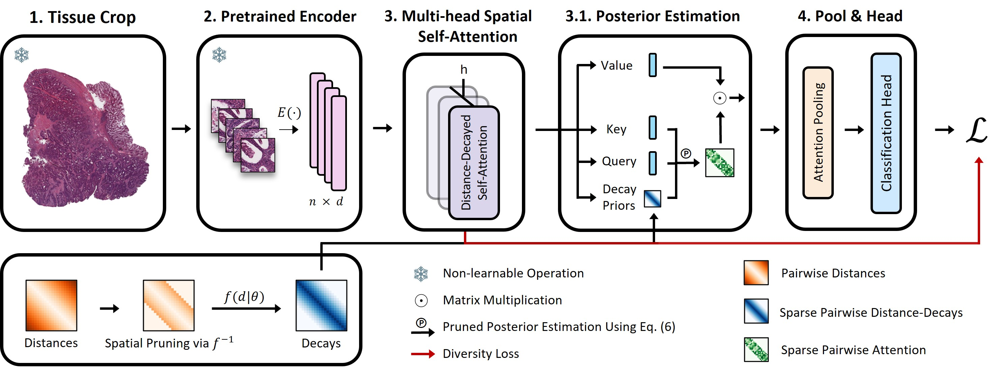

# PSA-MIL: Probabilistic Spatial Attention-Based Multiple Instance Learning for Whole Slide Image Classification  

<div align="center">

  <a href="https://arxiv.org/abs/2503.16284">
    
  </a>
  
  
  
  

</div>


## PSA-MIL Overview



## 📝 Updates

- **2025-05-20** – Refactored core modules for improved code structure and utility.
- **2025-05-15** – Added support for the survival prediction task.
- **2025-04-17** – Introduced a diversity loss option using Gaussian binning, which showed greater stability compared to the Monte Carlo-based approach.
- **2025-03-26** – Initial project launch 🚀


## Highlights
- **State-of-the-Art Performance** – PSA-MIL achieves leading results in WSI classification with adaptive spatial modeling.
- **Dynamic Local Attention** – Learns spatial dependencies dynamically, avoiding predefined spatial constraints.
- **Computational Efficiency** – Reduces self-attention complexity using a spatial pruning strategy.
- **Diversity Loss** – Encourages distinct spatial patterns across attention heads to enhance feature representation.

---

<details>
  <summary><b>What is PSA-MIL?</b> (Click to expand)</summary>

PSA-MIL is an **attention-based Multiple Instance Learning (MIL) framework** for Whole Slide Image (WSI) classification.  
It introduces a **probabilistic formulation of self-attention** to incorporate **spatial relationships** among image tiles.

### Key Contributions:
- **Probabilistic Spatial Attention**  
  - Reformulates self-attention as a **posterior distribution** with learnable **distance-decayed priors**.
  - Enables adaptive modeling of spatial dependencies during training.
  - Data-Driven Local Attention – The attention locality scope (K) is inferred during training.

- **Spatial Pruning for Efficiency**  
  - Self-attention is computationally expensive (**O(n²)** complexity).  
  - PSA-MIL **prunes less relevant spatial connections**, achieving sub-quadratic complexity while preserving key interactions.

- **Diversity Loss for Multi-Head Attention**  
  - Standard multi-head attention often suffers from redundancy, where different heads attend to similar regions.
  - PSA-MIL introduces an **entropy-based diversity loss** to promote **distinct spatial representations** across attention heads.

### Results:
- PSA-MIL achieves **SOTA performance** on WSI classification benchmarks.
- Outperforms both **contextual and non-contextual MIL approaches** while significantly **reducing computational costs**.
- Enables **efficient, adaptive spatial modeling** for large-scale histopathology analysis.

</details>

---


---

# Installation & Usage Guide

## **1. Data Preprocessing**
PSA-MIL requires preprocessed Whole Slide Image (WSI) tile embeddings. 
We used the following repo for tissue segmentation and cropping:

🔗 **WSI Preprocessing Repository**: [whole-slide-images-preprocessing-for-deep-learning](https://github.com/SharonPeled/whole-slide-images-preprocessing-for-deep-learning)

We preprocessed slides at a field of view (FoV) of 20x (0.5µm/px), tessellate into 512x512 pixel tiles.

Once preprocessing is complete, patch coordinates would be embedded directly within the patch filepath (e.g. tissue_10_103.jpg).

---

## **2. Environment Setup**
To set up the environment, you can use **Conda** or **pip**.

### **Using Conda (Recommended)**
```
conda env create -f env.yml
conda activate psa-mil
```

### **Using pip**
```
python -m venv psa-mil-env
source psa-mil-env/bin/activate 
pip install -r requirements.txt
```

---

## **3. Running PSA-MIL**
The main training pipeline is executed using `main.py`. Configurations are provided through a **YAML config file**.

### **Basic Run**
```
python main.py --train-PSA-MIL-classifier --config_filepath configs/default.yaml
```

### **Configuration File (`config_filepath`)**
- **All training, dataset, and model parameters** are defined in the config YAML.
- Modify it to adjust **batch size, learning rate, model architecture, spatial pruning thresholds**, etc.

## **Example Configurations**
See config_files/train_PSA_MIL_classifier.yaml for available configs and additional documentation. 

---


## **5. Reference**
```
@article{peled2025psa,
  title={PSA-MIL: A Probabilistic Spatial Attention-Based Multiple Instance Learning for Whole Slide Image Classification},
  author={Peled, Sharon and Maruvka, Yosef E and Freiman, Moti},
  journal={arXiv preprint arXiv:2503.16284},
  year={2025}
}
